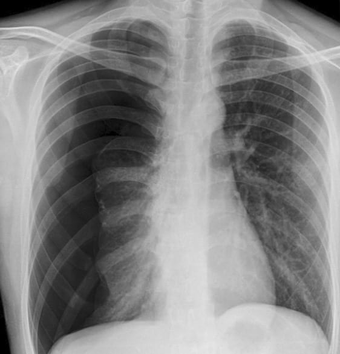

### **My Pages**

### About Me

PhD in machine learning since 2009, after nearly 10 years of researching brain disease, I am now Senior Data Scientist with Commonwealth Bank of Australia, applying advanced analytics for multiple business lines. Financial crime is one of my focused area since late 2017, and I am leading a team of data scientist, data engineer and software developer to build new capability for detecting suspicious transaction behaviour, employing graph/network method, as well as deep learning techniques on top of hadoop/spark and GPU.  

### Data Science Projects 
 Deep learning with GPU [setup & test with Win10 laptop](https://github.com/lyh710/dnn_gpu_setup_test), and [hello-world using public dataset](https://github.com/lyh710/dnn_gpu_hello_world).

### Kaggle
 [Kaggle competition for Pneunomthorax detection, using Deep-Learning](https://github.com/lyh710/kaggle.pneumothorax).

  

[Academic Publications](https://scholar.google.com/citations?user=sukavDAAAAAJ&hl=en&oi=sra)

  

**Follow me on**  
